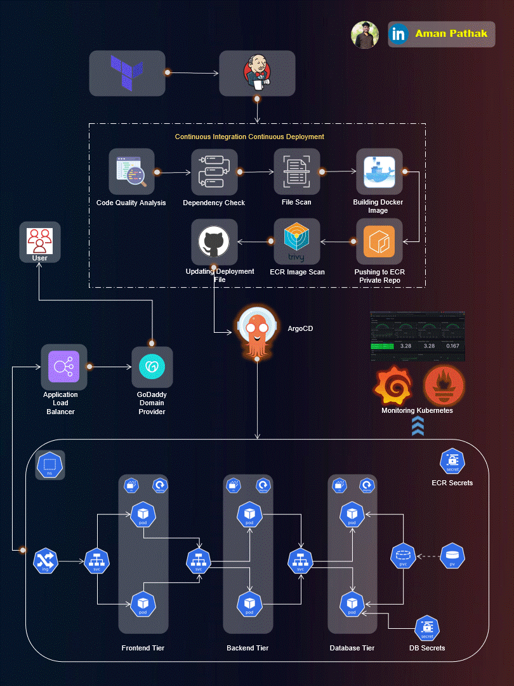

# End-to-End Kubernetes Three-Tier DevSecOps Project

This repository contains an end-to-end DevSecOps deployment workflow for a three-tier web application on AWS. The stack combines a React frontend, a Node.js/Express backend, MongoDB, Jenkins-based CI/CD, Terraform-provisioned infrastructure, Amazon ECR image publishing, and Kubernetes manifests for deployment on Amazon EKS.

The application itself is a simple task management app, but the main focus of the project is the delivery pipeline and deployment architecture around it.



## Overview

The project is organized around four main concerns:

- application code for the frontend and backend services
- Jenkins pipelines for build, scan, image publishing, and deployment manifest updates
- Terraform for provisioning a Jenkins server and related AWS resources
- Kubernetes manifests for deploying the frontend, backend, and database tiers

## Architecture

The deployed system follows a standard three-tier pattern:

1. `Frontend`
   A React application exposed through an AWS ALB ingress.
2. `Backend`
   A Node.js/Express API that serves task CRUD operations and exposes health, readiness, and startup endpoints.
3. `Database`
   A MongoDB deployment with persistent storage and credentials supplied through Kubernetes secrets.

The CI/CD flow is built around Jenkins:

- checkout source code from GitHub
- run SonarQube analysis
- run Trivy filesystem and image scans
- build Docker images
- push images to Amazon ECR
- update Kubernetes deployment manifests with the new image tag

## Tech Stack

- React
- Node.js
- Express
- MongoDB
- Docker
- Jenkins
- Terraform
- AWS EC2
- Amazon ECR
- Amazon EKS
- Kubernetes
- SonarQube
- Trivy

## Repository Structure

```text
Application-Code/
  frontend/                  React client
  backend/                   Node.js/Express API

Jenkins-Pipeline-Code/
  Jenkinsfile-Frontend       CI/CD pipeline for the frontend image
  Jenkinsfile-Backend        CI/CD pipeline for the backend image

Jenkins-Server-TF/
  *.tf                       Terraform for Jenkins host, IAM, VPC, and networking
  tools-install.sh           Bootstrap script for Jenkins server tooling

Kubernetes-Manifests-file/
  Frontend/                  Frontend deployment and service
  Backend/                   Backend deployment and service
  Database/                  MongoDB deployment, PV, PVC, service, and secrets
  ingress.yaml               AWS ALB ingress configuration
```

## Application Components

### Frontend

The frontend is a React application that allows users to:

- create tasks
- mark tasks as completed
- delete tasks
- interact with the backend API through a simple task service layer

### Backend

The backend provides REST endpoints for:

- creating tasks
- listing tasks
- updating tasks
- deleting tasks

It also includes:

- `/healthz` for liveness checks
- `/ready` for readiness checks
- `/started` for startup checks

### Database

MongoDB is deployed inside the cluster and configured with:

- a Kubernetes deployment
- a persistent volume and persistent volume claim
- service discovery for the backend tier
- secret-based credentials

## Infrastructure and Deployment

### Terraform

The `Jenkins-Server-TF` directory provisions the Jenkins host and supporting AWS resources, including:

- VPC and subnet resources
- security groups
- IAM role and instance profile
- EC2 instance configuration

### Jenkins Pipelines

Both Jenkins pipelines follow a similar pattern:

- clean workspace
- checkout repository
- run SonarQube analysis
- run Trivy scan
- build Docker image
- push image to ECR
- update the Kubernetes deployment manifest with the new image tag

### Kubernetes

The manifests deploy:

- frontend service and deployment
- backend service and deployment
- MongoDB service and deployment
- ALB ingress for external traffic routing

The backend deployment also includes liveness, readiness, and startup probes.

## How To Run

This repository is primarily structured as an infrastructure and deployment project rather than a single-command local app. A typical setup flow is:

1. Provision the Jenkins environment with Terraform from `Jenkins-Server-TF/`.
2. Configure Jenkins tools and credentials for GitHub, SonarQube, AWS, and ECR.
3. Build and push frontend and backend images through the Jenkins pipelines.
4. Apply the Kubernetes manifests to an EKS cluster.
5. Access the application through the ALB ingress.

## Prerequisites

- AWS account
- Jenkins server
- Docker
- Terraform
- kubectl
- AWS CLI
- EKS cluster
- SonarQube server
- Trivy installed on the Jenkins runner

## Notes

- This repository includes deployment manifests and pipeline code, but environment-specific configuration still needs to be supplied through Jenkins credentials, AWS resources, and cluster setup.
- The manifests currently contain environment-specific image references and ALB/backend URLs, so they should be reviewed before reuse in another AWS account or region.
- The main value of the project is the end-to-end DevSecOps workflow, not the complexity of the demo application itself.

## License

This project is licensed under the [MIT License](LICENSE).
